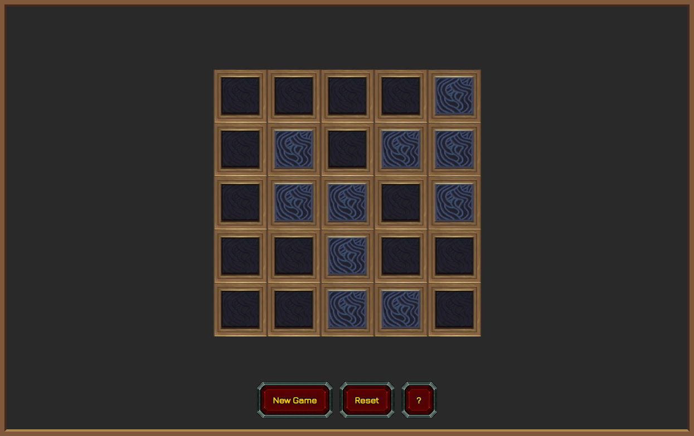

# Mezzonic Protolock
Mezzonic Protolock is a puzzle game from World of Warcraft patch 9.2. Also known as Lights Out.

Remade with P5JS.

The goal of this game is to switch all the lights off, preferably in as few button presses as possible. Every cell inverts 4 cells around it (up, down, left, right).

Live version can be found [here](https://games.yoro.dev/mezzonic/).

## Commands
### Installation
    npm install
    npm run dev

### Build
    npm run build